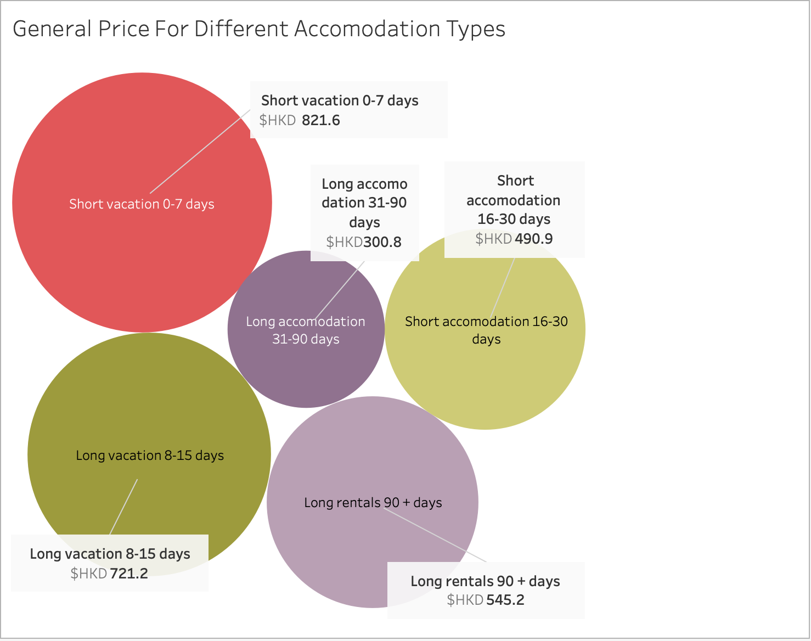
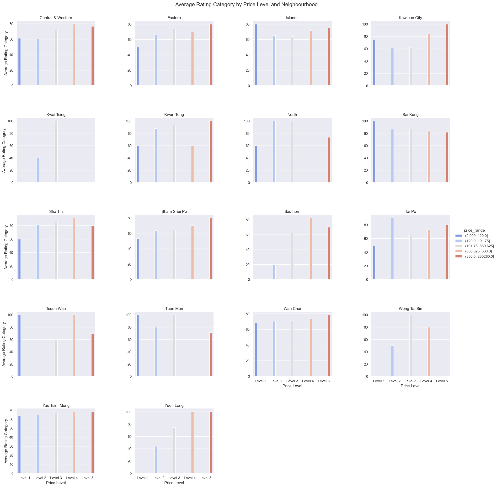
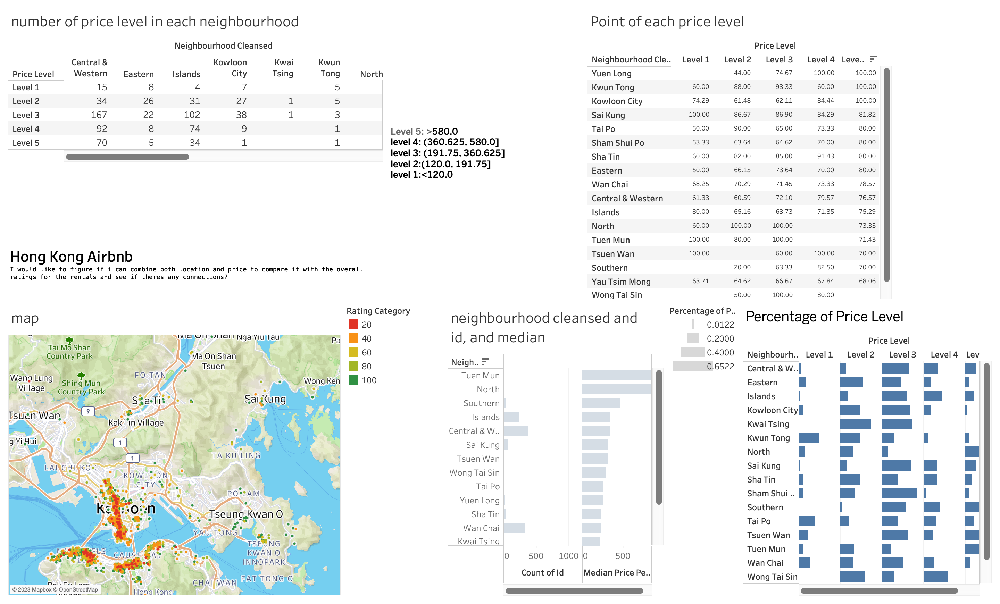

# Hong Kong Dragon

- Your title can change over time.

## Milestones

Details for Milestone are available on Canvas (left sidebar, Course Project).

## Describe your topic/interest in about 150-200 words

For this Data, as it is the airbnb data analysis in Hong Kong. We hope that our research and analysis can help companies, organizations, and people who want to or are already in Hong Kong to understand the concept of pricing in Hong Kong. And what is the average customer demand for a house. Our data will give third parties a better understanding of the market demand so they can improve their marketing strategies.

We are also interested in this data set because the price of housing is increasing due to the growing population. We want to understand how landlords and other sellers are pricing their homes. Airbnb is also one of the most popular software in the world, which allows us to collect more accurate data.

We can make a user facing dashboard for our data and we can use line graphs to analyze the pricing difference, bar graphs to identify the demand of amenities, and pie graphs to analyze the percentage of where most housing locate.x
## Describe your dataset in about 150-200 words
Our data is provided by Inside Airbnb, which is a mission driven project founded by Murray Cox, who is an artist and technologist who compile the data and built the site. In the data, there are more than 60 columns which indicate the detail information(id, name of owners, url, location of owners, rental fee, positon, reviews and so on). We chose Hong Kong set as our dataset, we want to understand the population of HongKong rental housings from the different amanties and demands. This was compiled on 23 December, 2022. This site was built in order to realize a future in which communities are empowered by data and information to comprehend, make decisions, and oversee the process of renting residential homes to tourists. The site in completely public and everyone is able to get access to the data.

## Team Members

- Ximin Xu: I am a Computer Science third-year student. I am interested in coding.
- Jeremy Liu: I am currently a MGMT third year student. Im interested in music and video gaming.
- Wing Fan: I am a third year Management Student, focusing in marketing and business analytic. My passions are traveling and cafe hopping.

## Images

{You should use this area to add a screenshot of an interesting plot, or of your dashboard}

## References

