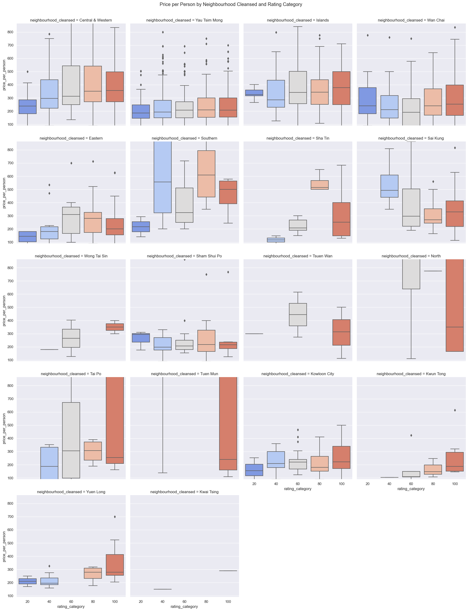
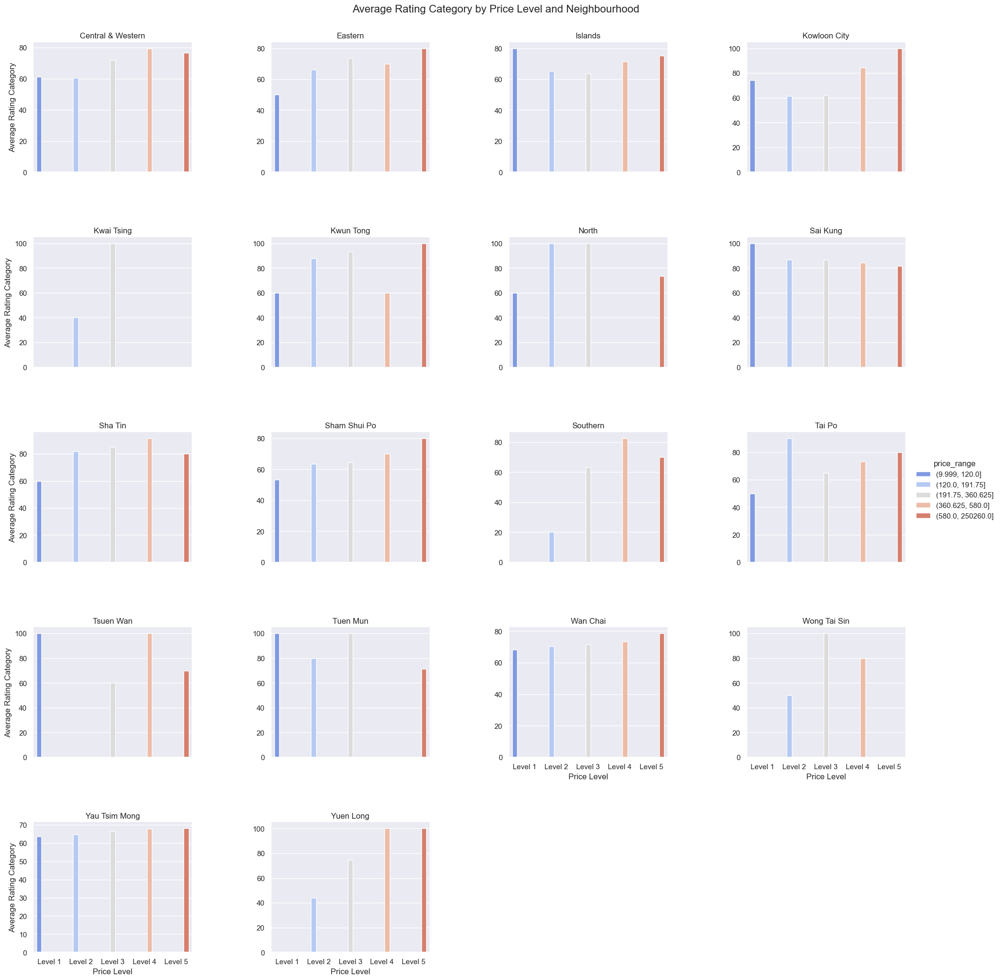

# Data301 Group62 Final Project Report 

## Introduction 
 Our project is to discover the infrastructure of HongKong Airbnb based on a comprehensive aspect of  geometry, pricing, ratings, amenities provided, size of the rentals. Our group have huge interest in finding the most affordable and livable rentals across the world; Airbnb is one of the platform that we often used for travel and booking accomodation. This project is not only for customer like us who are searching for the right rentals, it is also practical for potential Airbnb host to analyze the HongKong Airbnb rental market. Targeting the customers need, and meeting the consumer's demand and ability to compete with the existing competitors.  

## Exploratory Data Analysis

### Question 1  How amenities provided and duration of the rentals impact the HongKong Airbnb pricing. 

figure 1.1 illustrates the top 20 amenities that are most commonly provided in HongKong Airbnb rentals. I calculated that each amenities was named in each listing, then sum up and rank the most popular and least popular amenities in HongKong Airbnb. We can see that air conditioning is provided in more than 4,000 listing, following the ability for longterm stay, housing essentials and etc. 

figure 1.2 shows the price variation for different type of vacation. I first group the minimum-stay into days intervals and name them by the length of stay/type of accomodation. The vacation type is grouped by the "minimum_night" of stay from the data given. short vacation is 0-7 days, long vacation is 8-15 days, short accomodation is 16-30 days, long accomodation is 31-90 days, and the rest are identified as long term rentals. Through this chart, we understand that the long vacation has the larger difference between each listing and higher median price among the other. 

 
figure 1.3 From the dashboard here we have a more clear vision on the correlation between amenities demand, minimum nights and price. The line chart tells the price different for different length of minimum-nights stay, the chart on the left bottom shows the occurrence of each amenities in all the HongKong Airbnb, and the chart on the bottom right indicates which duration of stay is most common as well as the price compariston for each type of accomodation. The rare amenities such as bay view, beach view, bathtub and and so are mostly provided in listing that cost around HKD$1000-2000. In addition, short vacation and long vacation around 0-15 days are mostly higher price than longterm rentals. 

 

### Question 2 If i can combine both location and price to compare it with the overall ratings for the rentals and see if theres any connections?

In this figure, I caculate the price per person of each airbnb, and I also set a rating category base on their rating, the higher the rating is, the higher the rating category is. I calculate the price of each rating category base on neighbourhood. This can help us visualize how price affect the rating in the same neighbourhood.

In this figure, I calculate the average rating category. I also make the price into levels, which makes it more clear to see how price level affect the overall rating.

In this tableau, I also plot the rating on the map so that everyone is clearly to see that which airbnb has a high rating and which has a low rating

### Question 3 to what extend would Airbnb's room_type including bathroom, bedrooms affect the price?

In figure 3.1, i have calculated the relation between the average price and different roomtypes to see which is the most expensive roomtype and which is the cheapest. According to the graph, the most expensive roomtype would be entire home/apt. And the cheapest roomtype would be Shared room. By doing so i can know that what other factors could affect this. 

in figure 3.2 i have calculated the average pricing for different number of bedrooms and it turns out even though the price has been increasing and decreasing. But it is still a possitive relation between price and bedroom. We can see that in the next figure.

In figure 3.3, i have created a chart that shows the average number of bedrooms and bathrooms within each roomtype. By doing so we can get rid of the number of bedrooms/bathrooms that are too big or too small. According from this chart, we can see that the average bedrooms in each roomtype is around 1-2. And refering to figure 3.2, which we can prove that there is a possitive relation between bedrooms and price.

## Conclusion 
To sum up, the established connection between price, location, and rating, becomes essential for both Airbnb guests and hosts to make informed decisions based on the provided insights. Similarly, hosts can use the plot to set competitive prices for their properties, helping them attract guests and maintain favorable ratings.

From this project, we learn data wrangling, cleaning, and processing by using Python. Getting rid of the irrelevant information that would not help understanding our project. We also learn, using seaborn visualization tool to tell the story of the given data, make this data more clearly illustrated and discover the relationships between different variable. Different charts provide different aspect of the impretation and highlights. The combination of these techniques facilitated a comprehensive analysis of the Airbnb data, ultimately leading to valuable conclusions for both hosts and guests.