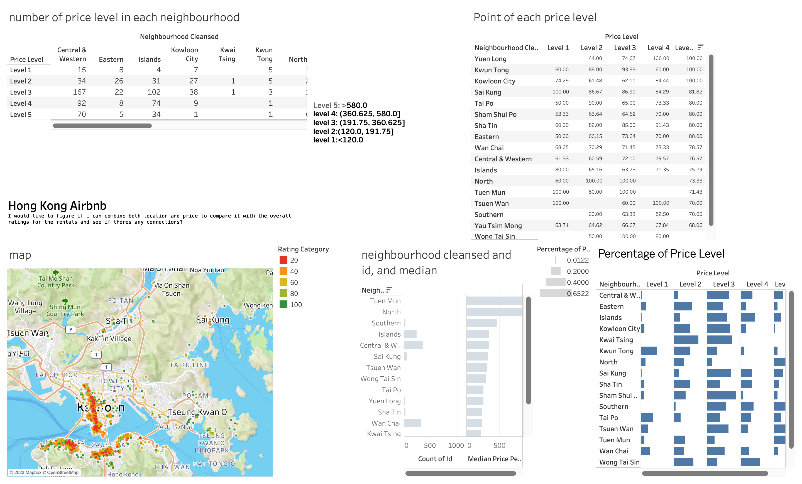

# Data301 Group62 Final Project Report 

## Introduction 
 Our project is to discover the infrastructure of HongKong Airbnb based on a comprehensive aspect of  geometry, pricing, ratings, amenities provided, size of the rentals. Our group have huge interest in finding the most affordable and livable rentals across the world; Airbnb is one of the platform that we often used for travel and booking accomodation. This project is not only for customer like us who are searching for the right rentals, it is also practical for potential Airbnb host to analyze the HongKong Airbnb rental market. Targeting the customers need, and meeting the consumer's demand and williness for a higher profit. 

## Exploratory Data Analysis

### Question 1  How amenities provided and duration of the rentals impact the HongKong Airbnb pricing. 
figure 1.1 illustrates the top 20 amenities that are most commonly provided in HongKong Airbnb rentals. we can see that air conditioning is provided in more than 4,000 listing, following the ability for longterm stay, housing essentials and etc. 

figure 1.2 shows the price variation for different type of vacation. The vacation type is grouped by the "minimum_night" of stay from the data given. short vacation is 0-7 days, long vacation is 8-15 days, short accomodation is 16-30 days, long accomodation is 31-90 days, and the rest are identified as long term rentals. Through this chart, we understand that the long vacation has the larger difference between each listing and higher median price among the other. 

 

 

### Question 2 If i can combine both location and price to compare it with the overall ratings for the rentals and see if theres any connections?

In this figure, I caculate the price per person of each airbnb, and I also set a rating category base on their rating, the higher the rating is, the higher the rating category is. I calculate the price of each rating category base on neighbourhood. This can help us visualize how price affect the rating in the same neighbourhood.

In this figure, I calculate the average rating category. I also make the price into levels, which makes it more clear to see how price level affect the overall rating.

In this tableau, I also plot the rating on the map so that everyone is clearly to see that which airbnb has a high rating and which has a low rating

### Question 3

## Conclusion 

